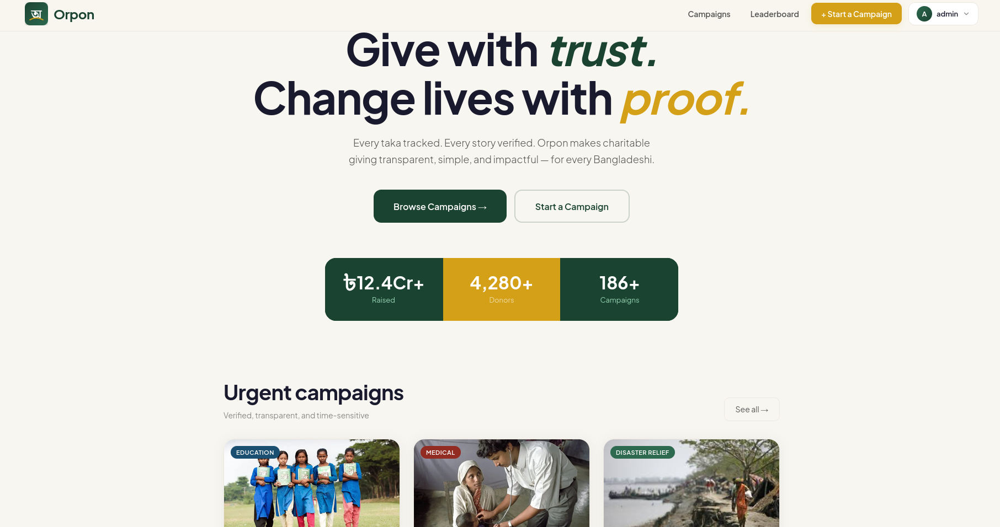

<div align="center">

# অ Orpon

### Transparent & Secured Crowdfunding

[](https://orpon.me)
[](https://thankful-sea-0f5fbd000.7.azurestaticapps.net)
[](https://orpon-backend-api-sea.azurewebsites.net/api/health)
[](LICENSE)

</div>

---

## Overview

**Orpon** is a donation transparency platform built for the Bangladeshi community. It lets individuals create fundraising campaigns for causes they care about — medical emergencies, disaster relief, education, or community projects — and accept donations via locally popular payment methods like bKash, Nagad, and Card.

### The Problem It Solves

Trust is the biggest barrier to online giving in Bangladesh. Donors often have no way to verify how their money is used. Orpon tackles this with a **tamper-evident, blockchain-style hash chain** that links every donation record cryptographically and optionally anchors the ledger hash to the **Polygon Amoy** testnet — giving any third party provable assurance that the donation history has not been altered.

### Target Users

- **Individual donors** who want to give with confidence
- **Campaign organizers** who need a transparent, verifiable record to build credibility
- **Platform administrators** who need real-time oversight and integrity verification
- **Community groups and NGOs** seeking a local-language-friendly fundraising tool

---

## Features

### User Authentication
- Secure registration and login with **bcrypt-hashed passwords** and **JWT tokens**
- Rate-limited auth endpoints to prevent brute-force attacks
- **Forgot password** flow with a secure, time-limited reset link (15-minute expiry)
- Branded password-reset email via SMTP (with Ethereal.email fallback for local testing)

### Campaign Creation & Management
- Rich campaign creation form: title, description, story, category, target amount, and duration
- Upload up to **3 campaign images** (stored on Cloudinary, served via CDN)
- GoFundMe-style **image slider carousel** on campaign detail pages
- Campaign categories: Medical, Education, Disaster Relief, Community
- Organizers can manage and delete their own campaigns via the **My Campaigns** dashboard

### Donations
- Guest-friendly: donors can give **anonymously, privately, or publicly**
- Blockchain-style **SHA-256 hash chain**: each donation record includes `previous_hash` and `current_hash`, forming a tamper-evident ledger
- Direct donation recording with payment method tracking

### Payment Integration (Sandbox)
- **bKash** – Bangladesh's leading MFS provider (tokenized sandbox)
- **Nagad** – Sandbox payment flow with callback verification
- **SSLCommerz** – Card payment sandbox (VISA/MasterCard) with success/fail/cancel callbacks
- Per-gateway Webhook/callback handlers for reliable payment status recording

### Donation Tracking & Public Ledger
- Public `/transactions` endpoint exposes the full donation ledger
- Each transaction shows amount, display name (respecting privacy settings), timestamp, and hash
- Any user can independently re-compute hashes to verify ledger integrity

### Comments
- Authenticated users can post, edit, and delete comments on any campaign
- Public read access so visitors can follow updates without signing in

### Donor Leaderboard
- Public leaderboard ranking the most generous named donors
- Anonymous and private donors are excluded from rankings, preserving privacy preferences

### Analytics Dashboard (Campaign Owner)
- Per-campaign donation totals, donor counts, and progress visualisation
- Owners see analytics only for campaigns they created

### Admin Dashboard
- Summary statistics: total campaigns, donations, users, and raised amount
- Full view of all campaigns, donations, and registered users
- **Integrity verification**: re-compute and compare hash chain in real time
- Promote users to admin role
- System activity log

### Blockchain Anchoring
- Batched donation hashes anchored to the **Polygon Amoy** testnet via a Solidity smart contract
- Anchoring is optional (gracefully disabled when credentials are absent)
- Public `/api/anchors/history` endpoint exposes all anchor records
- Admin-triggered manual anchoring available from the dashboard

### Verification & Trust Features
- Campaign `is_verified` flag (admin-settable)
- Unique NID and phone constraints on user accounts to reduce duplicate registrations
- Helmet.js HTTP security headers on every API response
- Strict CORS allowlist (only `orpon.me`, `www.orpon.me`, and configured origins)

---

## Technology Stack

### Frontend
| Technology | Purpose |
|---|---|
| React 19 | UI library |
| React Router v6 | Client-side routing |
| Vite 8 | Build tool & dev server |
| Tailwind CSS 3 | Utility-first styling |
| Lucide React | Icon set |
| qrcode.react | QR code generation |
| Plus Jakarta Sans (Google Fonts) | Typography |

### Backend
| Technology | Purpose |
|---|---|
| Node.js + Express 5 | REST API server |
| Helmet.js | HTTP security headers |
| Morgan | HTTP request logging |
| Nodemailer | Transactional email (password reset) |
| Multer | Multipart image upload handling |
| bcrypt | Password hashing |
| jsonwebtoken | Stateless JWT authentication |
| uuid | Unique ID generation |
| crypto (Node built-in) | SHA-256 hash chain |
| ethers.js v6 | Polygon blockchain interaction |

### Database
| Technology | Purpose |
|---|---|
| Azure SQL Database (MSSQL) | Primary relational database |
| mssql (npm) | SQL Server driver |
| Redis (optional) | Session / cache layer (falls back to in-memory) |

### Cloud & Storage
| Service | Purpose |
|---|---|
| Azure App Service | Backend hosting (Southeast Asia region) |
| Azure Static Web Apps | Frontend hosting + global CDN |
| Cloudinary | Campaign image storage & delivery |

### Payment Gateways (Sandbox)
| Gateway | Method |
|---|---|
| bKash | Bangladesh MFS (tokenized API) |
| Nagad | Bangladesh MFS (sandbox) |
| SSLCommerz | Card payments (VISA/MC sandbox) |

### Blockchain
| Component | Details |
|---|---|
| Network | Polygon Amoy testnet |
| Contract | Custom Solidity contract storing batch hashes |
| Library | ethers.js v6 |

### DevOps / CI-CD
| Tool | Purpose |
|---|---|
| GitHub Actions | Automated CI/CD pipelines |
| Azure Static Web Apps Deploy Action | Frontend deployment |
| Azure Web Apps Deploy Action | Backend deployment |

---

## Screenshots

> 📸 **Add screenshots here.** Recommended sections to capture:
>
> | Page | Description |
> |---|---|
> | `Home` | Hero section, featured campaigns, trust highlights |
> | `Explore` | Campaign listing with category filters |
> | `Campaign Detail` | Image carousel, donation progress bar, comment section |
> | `Create Campaign` | Multi-image upload form |
> | `Donate` | Payment gateway selection screen |
> | `Payment Success/Fail` | Redirect pages |
> | `Admin Dashboard` | Stats, tables, integrity check |
> | `Leaderboard` | Ranked donors |
> | `Forgot/Reset Password` | Email-based flow |
>
> Place images in a `docs/screenshots/` folder and embed with:
> ```markdown
> 
> ```

---

## Installation

### Prerequisites

- **Node.js** v20 or higher
- **npm** v9+
- An **Azure SQL** database (or any MSSQL-compatible server)
- A **Cloudinary** account (free tier is sufficient)
- (Optional) **Redis** instance

### 1. Clone the Repository

```bash
git clone https://github.com/<your-org>/Orpon.git
cd Orpon
```

### 2. Backend Setup

```bash
cd backend
npm install
cp .env.example .env
# Edit .env with your credentials (see Environment Variables section)
```

### 3. Database Setup

Run the provided SQL schema against your Azure SQL (or MSSQL) database:

```bash
# Using sqlcmd
sqlcmd -S <server>.database.windows.net -U <username> -P <password> -d donation_system -i schema.sql

# Or paste schema.sql contents into Azure Data Studio / SSMS
```

The schema creates four tables: `users`, `campaigns`, `donations`, `comments`.

### 4. Frontend Setup

```bash
cd ../frontend
npm install
cp .env.example .env
# Set VITE_API_URL if you want to point to a remote backend
```

---

## Environment Variables

### Backend (`backend/.env`)

```env
# Server
PORT=5000

# URLs (must match deployed URLs for payment callbacks)
BACKEND_URL=http://localhost:5000
FRONTEND_URL=http://localhost:5173

# Azure SQL Database
DB_HOST=your-server.database.windows.net
DB_USER=your_username
DB_PASSWORD=your_password
DB_NAME=donation_system
DB_PORT=1433
DB_TRUST_CERT=false

# Redis (optional – falls back to in-memory)
USE_REDIS=false
REDIS_URL=redis://localhost:6379

# Security
JWT_SECRET=<generate with: node -e "console.log(require('crypto').randomBytes(32).toString('hex'))">

# Cloudinary (optional – set all three or none)
CLOUDINARY_CLOUD_NAME=your_cloud_name
CLOUDINARY_API_KEY=your_api_key
CLOUDINARY_API_SECRET=your_api_secret

# bKash Sandbox
BKASH_USERNAME=your_bkash_sandbox_username
BKASH_PASSWORD=your_bkash_sandbox_password
BKASH_APP_KEY=your_bkash_app_key
BKASH_APP_SECRET=your_bkash_app_secret
BKASH_BASE_URL=https://tokenized.sandbox.bka.sh/v1.2.0-beta

# SSLCommerz Sandbox
SSLCOMMERZ_STORE_ID=your_store_id
SSLCOMMERZ_STORE_PASSWORD=your_store_password
SSLCOMMERZ_BASE_URL=https://sandbox.sslcommerz.com

# SMTP (for password reset emails)
SMTP_HOST=smtp.gmail.com
SMTP_PORT=587
SMTP_USER=your_email@gmail.com
SMTP_PASS=your_gmail_app_password
SMTP_FROM=your_email@gmail.com

# Blockchain (optional – Polygon Amoy)
POLYGON_RPC_URL=https://rpc-amoy.polygon.technology/
WALLET_PRIVATE_KEY=0x...
CONTRACT_ADDRESS=0x...
```

> **⚠️ Warning:** Never commit your `.env` file. The `.gitignore` already excludes it.

### Frontend (`frontend/.env`)

```env
# Leave unset for local development (auto-detects localhost)
# Set for production builds or when using a remote backend
VITE_API_URL=http://localhost:5000/api
```

---

## Running Locally

### Start the Backend

```bash
cd backend
npm run dev       # uses nodemon for hot-reload
# or
npm start         # production-mode start
```

Backend runs on **http://localhost:5000**. Health check: `GET /api/health`

### Start the Frontend

```bash
cd frontend
npm run dev
```

Frontend dev server runs on **http://localhost:5173**.

### Build the Frontend for Production

```bash
cd frontend
npm run build     # outputs to frontend/dist/
npm run preview   # local preview of production build
```

---

## Project Structure

```
Orpon/
├── .github/
│   └── workflows/
│       ├── azure-static-web-apps-*.yml   # Frontend CI/CD (GitHub Actions)
│       └── azure-web-app-backend.yml     # Backend CI/CD (GitHub Actions)
│
├── backend/
│   ├── config/         # DB connection & env validation
│   ├── controllers/    # Route handlers (auth, campaign, donation, payment, admin, ...)
│   │   ├── adminController.js
│   │   ├── anchorController.js     # Blockchain anchoring
│   │   ├── authController.js       # Register, login, password reset
│   │   ├── campaignController.js
│   │   ├── commentController.js
│   │   ├── donationController.js
│   │   ├── leaderboardController.js
│   │   └── paymentController.js    # bKash, Nagad, SSLCommerz
│   ├── middleware/
│   │   ├── adminMiddleware.js      # Role guard (admin/super_admin)
│   │   ├── authMiddleware.js       # JWT verification
│   │   └── rateLimiter.js          # Auth rate limiting
│   ├── routes/         # Express route definitions (one file per resource)
│   ├── services/
│   │   ├── blockchainService.js    # Polygon Amoy anchoring via ethers.js
│   │   ├── emailService.js         # Nodemailer / Ethereal fallback
│   │   └── hashService.js          # SHA-256 hash computation
│   ├── schema.sql      # Azure SQL (T-SQL) database schema
│   ├── server.js       # Express app entry point
│   └── .env.example    # Environment variable template
│
├── frontend/
│   ├── public/         # Static assets (favicon, etc.)
│   └── src/
│       ├── assets/         # Images & SVGs
│       ├── components/
│       │   ├── layout/     # Navbar, Footer
│       │   └── ui/         # Reusable UI components
│       ├── context/        # AuthContext (global auth state)
│       ├── data/           # Fallback mock campaign data
│       ├── pages/          # One file per route/page
│       │   ├── AdminDashboard.jsx
│       │   ├── CampaignAnalytics.jsx
│       │   ├── CampaignDetail.jsx
│       │   ├── CreateCampaign.jsx
│       │   ├── Donate.jsx
│       │   ├── ForgotPassword.jsx
│       │   ├── Home.jsx
│       │   ├── Leaderboard.jsx
│       │   ├── Login.jsx
│       │   ├── MyCampaigns.jsx
│       │   ├── NagadSandbox.jsx        # Nagad sandbox redirect handler
│       │   ├── PaymentSuccess/Fail/Cancel.jsx
│       │   ├── Profile.jsx
│       │   └── ResetPassword.jsx
│       ├── utils/
│       │   ├── api.js      # Centralised API helper functions
│       │   └── format.js   # Currency, slug, percentage helpers
│       ├── App.jsx         # Root component & router setup
│       └── main.jsx        # React entry point
│
├── staticwebapp.config.json    # Azure SPA routing config
├── schema.sql                  # (duplicate) Root-level schema reference
└── README.md
```

---

## API Overview

All endpoints are prefixed with `/api`.

### Authentication — `/api/auth`

| Method | Path | Auth | Description |
|--------|------|------|-------------|
| `POST` | `/register` | — | Register a new user |
| `POST` | `/login` | — | Login, receive JWT |
| `GET` | `/me` | ✅ JWT | Get authenticated user profile |
| `POST` | `/forgot-password` | — | Request password reset email |
| `GET` | `/reset-password/verify` | — | Verify reset token validity |
| `POST` | `/reset-password` | — | Set new password with valid token |

### Campaigns

| Method | Path | Auth | Description |
|--------|------|------|-------------|
| `GET` | `/campaigns` | — | List all campaigns |
| `POST` | `/campaign/create` | ✅ JWT | Create a campaign (up to 3 images) |
| `DELETE` | `/campaign/:id` | ✅ JWT | Delete own campaign |

### Donations & Payments

| Method | Path | Auth | Description |
|--------|------|------|-------------|
| `POST` | `/donate` | — | Record a direct donation |
| `GET` | `/transactions` | — | Public ledger of all donations |
| `POST` | `/payment/bkash/initiate` | — | Start bKash sandbox payment |
| `GET` | `/payment/bkash/callback` | — | bKash callback handler |
| `POST` | `/payment/card/initiate` | — | Start SSLCommerz card payment |
| `POST` | `/payment/card/success` | — | SSLCommerz success callback |
| `POST` | `/payment/card/fail` | — | SSLCommerz failure callback |
| `POST` | `/payment/card/cancel` | — | SSLCommerz cancel callback |
| `POST` | `/payment/nagad/initiate` | — | Start Nagad sandbox payment |
| `POST` | `/payment/nagad/callback` | — | Nagad payment verification |
| `POST` | `/payment/nagad/cancel` | — | Nagad cancel callback |

### Comments

| Method | Path | Auth | Description |
|--------|------|------|-------------|
| `GET` | `/campaign/:id/comments` | — | Fetch comments for a campaign |
| `POST` | `/campaign/:id/comments` | ✅ JWT | Post a comment |
| `PUT` | `/comment/:id` | ✅ JWT | Edit own comment |
| `DELETE` | `/comment/:id` | ✅ JWT | Delete own comment |

### Leaderboard

| Method | Path | Auth | Description |
|--------|------|------|-------------|
| `GET` | `/leaderboard` | — | Top named donors (anonymous excluded) |

### Admin — Role: `admin` or `super_admin`

| Method | Path | Auth | Description |
|--------|------|------|-------------|
| `GET` | `/admin/stats` | ✅ Admin | Platform-wide statistics |
| `GET` | `/admin/campaigns` | ✅ Admin | All campaigns |
| `GET` | `/admin/donations` | ✅ Admin | All donations |
| `GET` | `/admin/logs` | ✅ Admin | System activity log |
| `GET` | `/admin/verify` | ✅ Admin | Hash chain integrity check |
| `GET` | `/admin/users` | ✅ Admin | All registered users |
| `POST` | `/admin/make-admin` | ✅ Admin | Promote user to admin |

### Blockchain Anchors

| Method | Path | Auth | Description |
|--------|------|------|-------------|
| `GET` | `/anchors/history` | — | Public anchor records from Polygon |
| `GET` | `/anchors/status` | ✅ Admin | Blockchain connection status |
| `POST` | `/anchors/manual` | ✅ Admin | Trigger a manual anchor transaction |

---

## Deployment

Orpon is deployed on **Microsoft Azure** using GitHub Actions CI/CD.

### Frontend
- Hosted on **Azure Static Web Apps** (Southeast Asia)
- **Deployed automatically** on every push to the `development` branch
- Build: `cd frontend && npm ci && npm run build` (Vite → `frontend/dist/`)
- `staticwebapp.config.json` configures SPA fallback routing so React Router links work on direct navigation

### Backend
- Hosted on **Azure App Service** (`orpon-backend-api-sea`)
- **Deployed automatically** on every push to the `development` branch
- Deployment package: `deploy.zip` (backend source, excluding `node_modules` and `.env`)
- App Service runs `node server.js` via the `start` script in `package.json`
- All environment variables are configured as **Application Settings** in Azure Portal (never in the zip)

### Custom Domain
- Live at **[https://orpon.me](https://orpon.me)** — configured via Azure Static Web Apps custom domain

### Key Azure Resources

| Resource | Name |
|---|---|
| Static Web App | `thankful-sea-0f5fbd000` |
| App Service (Backend) | `orpon-backend-api-sea` |
| SQL Server | `orpon-sql-server.database.windows.net` |
| Resource Group | `OrponRG` |

---

## Contributors

| Contributor | Commits |
|---|---|
| shezanyo | 76 |
| mibon201101 | 24 |
| ssunjana | 6 |
| Shahrier Azad Shezan | 3 |
| rrumi25800 | 3 |

> Want to contribute? Open a pull request against the `development` branch.

---

## License

This project is released under the **MIT License**.

```
MIT License

Copyright (c) 2025 Orpon Contributors

Permission is hereby granted, free of charge, to any person obtaining a copy
of this software and associated documentation files (the "Software"), to deal
in the Software without restriction, including without limitation the rights
to use, copy, modify, merge, publish, distribute, sublicense, and/or sell
copies of the Software, and to permit persons to whom the Software is
furnished to do so, subject to the following conditions:

The above copyright notice and this permission notice shall be included in all
copies or substantial portions of the Software.

THE SOFTWARE IS PROVIDED "AS IS", WITHOUT WARRANTY OF ANY KIND, EXPRESS OR
IMPLIED, INCLUDING BUT NOT LIMITED TO THE WARRANTIES OF MERCHANTABILITY,
FITNESS FOR A PARTICULAR PURPOSE AND NONINFRINGEMENT. IN NO EVENT SHALL THE
AUTHORS OR COPYRIGHT HOLDERS BE LIABLE FOR ANY CLAIM, DAMAGES OR OTHER
LIABILITY, WHETHER IN AN ACTION OF CONTRACT, TORT OR OTHERWISE, ARISING FROM,
OUT OF OR IN CONNECTION WITH THE SOFTWARE OR THE USE OR OTHER DEALINGS IN THE
SOFTWARE.
```

---

<div align="center">
  Built with ❤️ for transparent giving in Bangladesh.<br>
  <strong><a href="https://orpon.me">orpon.me</a></strong>
</div>