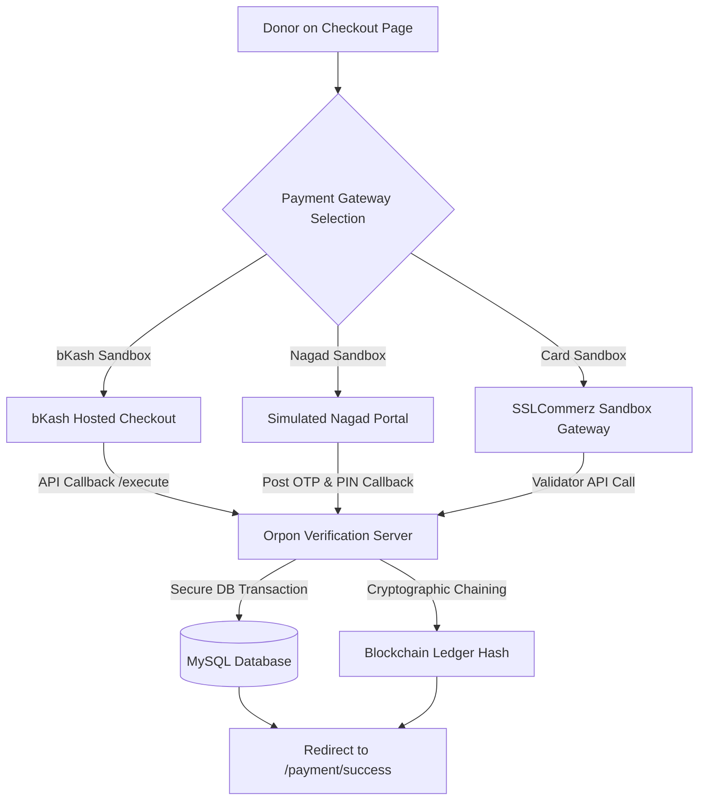

# Orpon Donation Platform: Payment System Testing & Demo Guide
> **Academic Demonstration & Faculty Evaluation Reference**

This comprehensive guide describes the architecture, workflows, credentials, and step-by-step procedures for demonstrating the payment gateway integrations of the **Orpon Donation Platform**. 

The payment system is designed with a hybrid approach, combining real sandbox integrations with local simulation, illustrating robust, industry-grade financial transactions with full verification and database persistence.

---

## 1. System Overview & Architecture

> [!IMPORTANT]
> **No real money or financial liabilities are involved in this platform.** The entire application operates exclusively in secure **SANDBOX (TEST)** environments. Transactions are for educational demonstration and faculty evaluation only.

The Orpon payment system integrates three distinct transaction pipelines, simulating standard payment behaviors in Bangladesh:



### Supported Payment Gateways

1. **bKash Sandbox** (Tokenized Checkout): Fully integrated with bKash's official sandbox API endpoints. Demonstrates secure JWT-like token generation (`grant` and `create` tokenized workflows) and backend-to-backend transaction validation (`execute` flow).
2. **Nagad Sandbox** (Simulated Integration): A local frontend-and-backend simulation that perfectly mirrors Nagad's security procedures (verification codes, PIN authentication, session timeouts) and demonstrates internal callback processing.
3. **Card Sandbox (SSLCommerz)**: Integrated with Bangladesh's leading payment gateway provider in sandbox mode. Demonstrates routing to SSLCommerz hosted checkout pages and backend-to-backend validation via the SSLCommerz Validator API.

---

## 2. Sandbox Credentials Directory

Use these pre-configured test credentials during demonstrations. Do not attempt to use real personal account details.

### A. bKash Sandbox Credentials

| Credential Type | Demonstration Value / Action | Description |
| :--- | :--- | :--- |
| **Test Wallet Number** | `01700000000` `01770618575` (or any valid 11-digit number) | Simulates the donor's personal bKash account |
| **Verification Code (OTP)**| Any 6-digit number (e.g., `123456`) | Automatically bypassed/accepted by bKash Sandbox |
| **PIN** | Any 5-digit number (e.g., `12345` `12121`) | Bypassed by bKash sandbox for testing ease |
| **Merchant Username** | `sandboxTokenizedUser02` | Registered test merchant for the Orpon Platform |
| **Merchant Password** | `sandboxTokenizedUser02@12345` | Secure test credentials configured in `.env` |
| **bKash Base Endpoint** | `https://tokenized.sandbox.bka.sh/v1.2.0-beta` | Official bKash Tokenized Checkout Sandbox API |

### B. Nagad Sandbox Credentials

| Credential Type | Demonstration Value | Validation Requirement |
| :--- | :--- | :--- |
| **Test Account Number** | Any valid 11-digit Bangladeshi mobile number (e.g., `01712345678`) | Must match pattern: `/^01[3-9]\d{8}$/` |
| **Verification Code (OTP)**| **`123456`** | **Strictly enforced** by validation logic |
| **Nagad PIN** | **`12121`** | **Strictly enforced** by validation logic |

### C. Card Sandbox (SSLCommerz) Credentials

Use any of the official SSLCommerz test cards during checkout.

| Card Brand | Test Card Number | Expiry Date | CVV | Simulation Action |
| :--- | :--- | :--- | :--- | :--- |
| **VISA** | `4000 1234 5678 9010` | Any future date (e.g., `12/28`) | `123` | Click **Success** or **Fail** on sandbox portal |
| **MasterCard** | `5412 7512 3412 3456` | Any future date (e.g., `12/29`) | `123` | Click **Success** or **Fail** on sandbox portal |
| **SSL Store ID** | `testbox` | - | - | Pre-configured in `.env` |
| **SSL Store Password** | `qwerty` | - | - | Pre-configured in `.env` |

---

## 3. End-to-End Demonstration Flow

This step-by-step walkthrough outlines how to execute a successful donation flow from start to finish.

### Step 1: Open the Campaign Page
1. Ensure the backend (`npm run dev` / `node server.js` on port `5000`) and frontend (`npm run dev` on port `5173`) are running.
2. Open your web browser and navigate to the Orpon home page: `http://localhost:5173`.
3. Browse the active campaigns and select one (e.g., *"Clean Water Initiative"*).
4. Click on the **Donate Now** button. This will route you to the configuration page:
   `http://localhost:5173/donate/:campaign_id`

### Step 2: Configure the Donation
1. **Choose Amount (BDT)**: Select one of the preset quick donation amounts (e.g., `৳1,000`, `৳2,500`) or input a custom amount in the BDT input field.
2. **Donor Privacy Selection**:
   - *Publicly*: Enter your full name. It will be public on the ledger.
   - *Anonymously*: Your real name is hidden. The display name on the ledger will show as `Anonymous`.
   - *Pseudonym*: The system will automatically generate a randomized pseudonym (e.g., `Donor-4821`) to protect your identity while preserving a distinct profile.
3. **Select Payment Gateway**: Choose either **bKash**, **Nagad**, or **Card**.
4. Click the prominent green button: **Contribute ৳[Amount] via [Gateway]**.

### Step 3: Authorize and Complete Sandbox Payment
*Depending on the selected payment method, follow the detailed sub-steps in Section 4, 5, or 6 below.*

### Step 4: Redirection and Success Verification
1. Once authorized, the gateway communicates back to Orpon's backend callback endpoints.
2. The server processes the callback, records the donation securely, handles blockchain cryptographic hash chaining, and redirects the client to:
   `http://localhost:5173/payment/success?donationId=[UUID]&amount=[Amount]`
3. Review the **Donation Successful!** screen. The page will display the generated **Secure Transaction ID** (UUID). Click **Copy** to save the ID.

### Step 5: Database and Ledger Verification
To prove database integrity to faculty members, open your database client (e.g., phpMyAdmin, MySQL Workbench, or CLI) and run these verification queries:

*   **Query 1: Verify the Donation Record**
    ```sql
    SELECT id, donor_name, privacy_type, display_name, amount, created_at, previous_hash, current_hash 
    FROM donations 
    ORDER BY created_at DESC 
    LIMIT 1;
    ```
    *Observe that the `display_name` aligns with the selected privacy type and that a complex cryptographic hash has been generated for transparency.*

*   **Query 2: Verify Campaign Progression**
    ```sql
    SELECT title, target_amount, raised_amount, donor_count 
    FROM campaigns 
    WHERE id = '[YOUR_CAMPAIGN_ID]';
    ```
    *Observe that the campaign's `raised_amount` has precisely incremented by the donation amount and the `donor_count` has increased by 1.*

---

## 4. bKash Sandbox Checkout Flow

```
[Donor Checkout Page] -> POST /payment/bkash/initiate
  -> Server obtains Grant Token -> Server creates payment session
  -> Redirect to https://tokenized.sandbox.bka.sh/...
  -> Enter Test Wallet -> Enter OTP -> Enter PIN -> Click Confirm
  -> Callback GET /payment/bkash/callback -> Execute Payment -> Redirect Success Page
```

1. **Initiation**: Selecting bKash and clicking "Contribute" executes a `POST` request to `/api/payment/bkash/initiate`.
2. **Redirection**: You are redirected to the official bKash Tokenized Checkout screen (hosted on `tokenized.sandbox.bka.sh`).
3. **Wallet Authentication**:
   - In the bKash checkout panel, enter the test wallet number: `01700000000` (or any valid 11-digit mobile number starting with `01`).
   - Click **Proceed**.
4. **One-Time Password (OTP)**:
   - The screen will request a 6-digit OTP. 
   - Enter **`123456`** (or any 6 digits).
   - Click **Proceed**.
5. **Security PIN Entry**:
   - The screen will prompt for the wallet PIN.
   - Enter **`12345`** (or any 5 digits).
   - Click **Confirm**.
6. **Backend Callback Execution**:
   - bKash redirects back to Orpon's server callback: `http://localhost:5000/api/payment/bkash/callback?paymentID=...&status=success`.
   - The backend reads the payment ID, invokes the bKash `/checkout/execute` API, inserts the transaction into the database, updates the campaign metrics, and redirects the donor to the frontend success route.

---

## 5. Nagad Sandbox Checkout Flow

```
[Donor Checkout Page] -> POST /payment/nagad/initiate
  -> Redirect to Frontend Route: /donate/nagad-sandbox?sessionId=NGD-...
  -> Input 11-Digit Mobile Number -> Proceed
  -> Input Sandbox OTP (123456) -> Proceed
  -> Input Sandbox PIN (12121) -> Submit
  -> POST /api/payment/nagad/callback -> Validate OTP/PIN -> DB Insert -> Redirect Success Page
```

1. **Initiation**: Selecting Nagad and clicking "Contribute" executes a `POST` request to `/api/payment/nagad/initiate`.
2. **Redirection**: You are redirected to the local, highly interactive Nagad Sandbox page:
   `http://localhost:5173/donate/nagad-sandbox?sessionId=NGD-[UUID]`
3. **Account Number Input**:
   - Input any standard 11-digit Bangladeshi mobile number starting with `013`-`019` (e.g., `01712345678`).
   - Click **Proceed**.
4. **Sandbox OTP Verification**:
   - The interface simulates sending an OTP to the number provided.
   - Input the required sandbox verification code: **`123456`**.
   - Click **Proceed**. *(Entering any other value triggers a validation error).*
5. **Secure PIN Verification**:
   - Enter the required sandbox PIN: **`12121`**.
   - Click **Submit**. *(Entering any other value triggers a validation error).*
6. **Callback Verification**:
   - The frontend transmits the payload `{ sessionId, otp, pin }` to the backend callback endpoint `/api/payment/nagad/callback`.
   - The backend validates the parameters, saves the transaction, commits the changes to MySQL, and instructs the frontend to complete the routing to `/payment/success`.

---

## 6. Card Sandbox (SSLCommerz) Checkout Flow

```
[Donor Checkout Page] -> POST /payment/card/initiate
  -> Redirect to https://sandbox.sslcommerz.com/gwprocess/...
  -> Click "Test Cards" -> Select VISA/MasterCard -> Enter Card details
  -> Click Pay -> POST /payment/card/success -> Validates val_id -> DB Insert -> Redirect Success Page
```

1. **Initiation**: Selecting Card and clicking "Contribute" executes a `POST` request to `/api/payment/card/initiate`.
2. **Redirection**: You are redirected to the official SSLCommerz Sandbox Hosted Gateway page on `sandbox.sslcommerz.com`.
3. **Selecting Test Card Mode**:
   - On the left panel of the SSLCommerz interface, select the **Test Cards** option.
   - Alternatively, choose the credit/debit card brands (Visa, MasterCard).
4. **Card Information Input**:
   - Input one of the credentials from the directory (e.g., VISA: `4000 1234 5678 9010`, Expiry: `12/28`, CVV: `123`).
   - Provide a simulated cardholder name (e.g., `Faculty Demo User`).
5. **Authorizing Transaction**:
   - Click the **Pay BDT [Amount]** button.
   - SSLCommerz will show a simulation authorization page. Click **Success** to complete the successful payment flow.
6. **Validator Callback Processing**:
   - SSLCommerz executes a `POST` request to Orpon's server callback route: `http://localhost:5000/api/payment/card/success`.
   - The server extracts the transaction ID and `val_id`, makes a background request to the SSLCommerz Validator API (`/validator/api/valid.php`) using the merchant credentials, creates the database record, and redirects the user back to the success page.

---

## 7. Common Troubleshooting & Error Resolution

If you encounter issues during your demonstration, check the following troubleshooting paths:

### 1. Payment Redirection Fails (CORS / Network Error)
*   **Symptom**: Clicking the checkout button shows a loading spinner permanently or prints an error in the developer console.
*   **Cause**: The backend server is not running, or there is a configuration mismatch in the `.env` file.
*   **Resolution**: 
    - Ensure your backend terminal is running and successfully listening on port `5000`.
    - Open `backend/.env` and verify that the `FRONTEND_URL` matches exactly `http://localhost:5173` and `BACKEND_URL` matches `http://localhost:5000`.

### 2. bKash "Failed to authenticate with bKash Sandbox"
*   **Symptom**: Redirection to bKash fails, backend logs return `502 Bad Gateway`.
*   **Cause**: The bKash Sandbox APIs are offline, or the tokenized checkout credentials have expired.
*   **Resolution**:
    - Ensure your computer is connected to the internet. bKash Sandbox is an external web service.
    - Verify your backend `.env` variables have the active sandbox keys:
      ```ini
      BKASH_USERNAME=sandboxTokenizedUser02
      BKASH_PASSWORD=sandboxTokenizedUser02@12345
      BKASH_APP_KEY=4f6o0cjiki2rfm34kfdadl1eqq
      BKASH_APP_SECRET=2is7hdktrekvrbljjh44ll3d9l1dtjo4pasmjvs5vl5qr3fug4b
      BKASH_BASE_URL=https://tokenized.sandbox.bka.sh/v1.2.0-beta
      ```

### 3. SSLCommerz "Failed to connect to SSLCommerz Sandbox"
*   **Symptom**: Redirection to SSLCommerz fails immediately.
*   **Cause**: Lack of active internet connection, or SSLCommerz credentials in `.env` are altered.
*   **Resolution**:
    - Verify internet connectivity.
    - Check that your `.env` contains the default store credential details:
      ```ini
      SSLCOMMERZ_STORE_ID=testbox
      SSLCOMMERZ_STORE_PASSWORD=qwerty
      SSLCOMMERZ_BASE_URL=https://sandbox.sslcommerz.com
      ```

### 4. Transactions Do Not Persist (Database Connection Errors)
*   **Symptom**: Payment succeeds, but redirection to the success page fails with a database-related error.
*   **Cause**: MySQL server is stopped, or the tables are not initialized.
*   **Resolution**:
    - Open the XAMPP Control Panel (or run `/opt/lampp/lampp start`) and ensure the MySQL service is active.
    - Verify the database named `donation_system` exists and the `donations` and `campaigns` tables are imported.

---

## 8. Important Notes & Faculty Highlights

When presenting this project to faculty members, emphasize the following points to showcase the quality of your engineering work:

1.  **Strict Security Practices**: Point out that all merchant credentials and secret keys are stored securely using backend environment variables (`.env`) and are **never** exposed to the client application.
2.  **Hybrid Callback Integration**: Highlight that you have implemented real production-ready callback paradigms. The payment status is verified via server-to-server secure validation API calls, protecting the system from client-side injection or spoofing attacks.
3.  **Donor Privacy Innovation**: Showcase the three levels of privacy control (Public, Anonymous, and Pseudonymous) and demonstrate how the system dynamically manages these options within the schema without breaking the cryptographic accountability chain.
4.  **Immutability Verification**: Demonstrate that every successful donation generates a unique SHA-256 cryptographic hash based on the donation amount, display name, timestamp, and the previous block's hash. This showcases a transparent, chain-of-custody public ledger.
